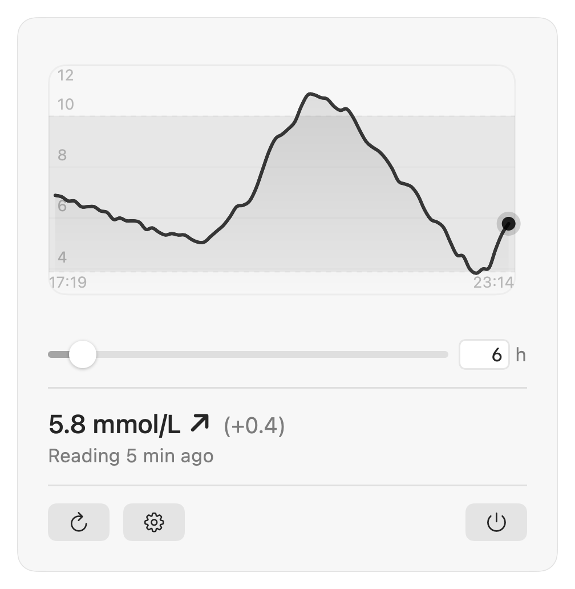

<div align="center">

<picture>
  <source media="(prefers-color-scheme: dark)" srcset="Resources/AppIcon-Dark.png">
  
</picture>

# Sugarglider

Your Nightscout blood glucose, in the macOS menu bar.

[](https://github.com/nvmddev/sugarglider/actions/workflows/ci.yml)
[](https://github.com/nvmddev/sugarglider/releases/latest)
[](https://github.com/nvmddev/sugarglider/releases)
[](#requirements)
[](LICENSE)

</div>

Your latest reading and its trend arrow sit in the menu bar. Everything else,
like the chart and the last few hours of history, is one click away. No dock
icon, no window in the way.

<picture>
  <source media="(prefers-color-scheme: dark)" srcset="docs/menubar-dark.png">
  
</picture>

<sub>Actual size. Plain, with the change since the last reading, and flagged
once it goes stale.</sub>

> Not a medical device. It shows what your Nightscout site already has, it can
> show stale or wrong values, and it never alarms. Treatment decisions belong
> with your approved CGM or meter and your care team.

## Install

```sh
brew install --cask nvmddev/tap/sugarglider
```

Or grab the `.dmg` from the [latest release](https://github.com/nvmddev/sugarglider/releases/latest)
and drag **Sugarglider.app** into `/Applications`. Universal binary, signed and
notarized, so it opens without a Gatekeeper detour.

Want it running after a restart? **System Settings → General → Login Items**,
then add Sugarglider.

## Set up

The menu bar shows `CGM ⚙` until you point it at a site. Click it, open
**Settings…** (or ⌘,) and fill in:

- **Nightscout URL**, e.g. `https://your-site.nightscout.app`
- **Access token**, if your site needs one. Make it in Nightscout under
  *Admin Tools → Subjects* with a read role. Leave it empty for a site that
  allows unauthenticated reads.

There's no Save button. Settings apply as you type, and the tab tells you
straight away whether the connection works.

## What it shows

<picture>
  <source media="(prefers-color-scheme: dark)" srcset="docs/dropdown-dark.png">
  
</picture>

<sub>Made up readings, not anyone's real data.</sub>

- The current value and trend arrow in the menu bar, optionally with the change
  since the last reading. Once a reading gets old it picks up a `⚠` and its
  age, so a short gap is easy to tell from a feed that died.
- A chart of the last 2 to 72 hours. Drag the slider or type an exact number of
  hours. Hover any point for its value and time. Gaps longer than 15 minutes
  break the line instead of pretending there was data.
- Color by zone: very low, below, in range, above, very high. Pick every
  color yourself, or blend them smoothly, or save a look as a preset and
  switch back to it later. The stock palette is monochrome and follows
  light and dark mode.
- mmol/L or mg/dL, switchable any time. Your target range and the very
  low/high bounds are yours to set.
- No notifications, ever. Sugarglider only sees your Nightscout site, so it
  can't tell a sensor gap from a flat uploader, and it won't pretend otherwise.

## Trend arrows

| Arrow | Nightscout direction |
|-------|----------------------|
| ↑↑    | DoubleUp             |
| ↑     | SingleUp             |
| ↗     | FortyFiveUp          |
| →     | Flat                 |
| ↘     | FortyFiveDown        |
| ↓     | SingleDown           |
| ↓↓    | DoubleDown           |

## Privacy

Sugarglider talks to your Nightscout site and nothing else. No telemetry, no
analytics, no third party anything. The URL and token stay in the app's
preferences on your Mac.

It polls your site once a minute by default, which you can change, and only
pulls chart history when you open the dropdown. After the first fetch it just
tops up what's new, so most opens need no request at all.

## Requirements

macOS 14 (Sonoma) or newer. Universal binary, so Apple silicon and Intel both
run natively.

## Build

```sh
git clone https://github.com/nvmddev/sugarglider.git
cd sugarglider
./build.sh
open Sugarglider.app
```

Pure Swift and SwiftUI, zero dependencies, about a 350 KB binary. `swift test`
needs Xcode rather than just the Command Line Tools.

Pull requests welcome. [CONTRIBUTING.md](CONTRIBUTING.md) has the setup, the
architecture in a paragraph, and the commit message format. Past releases are
in [CHANGELOG.md](CHANGELOG.md).

## License

[MIT](LICENSE)
